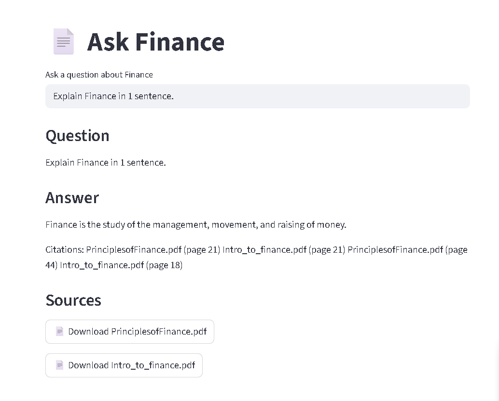
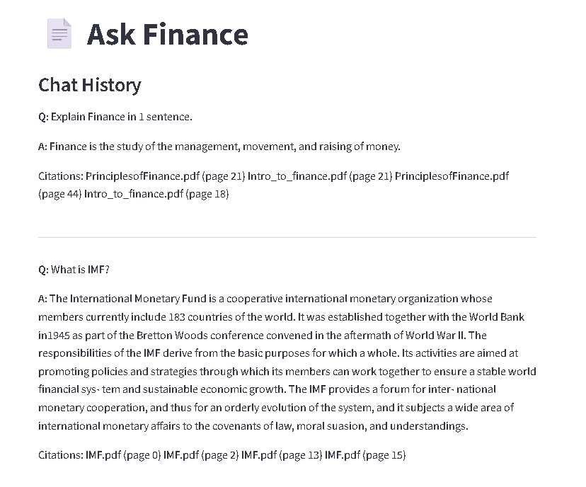
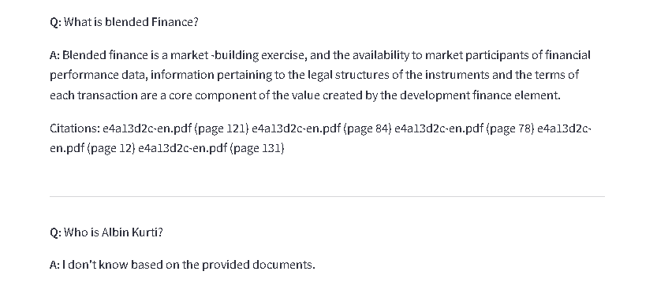
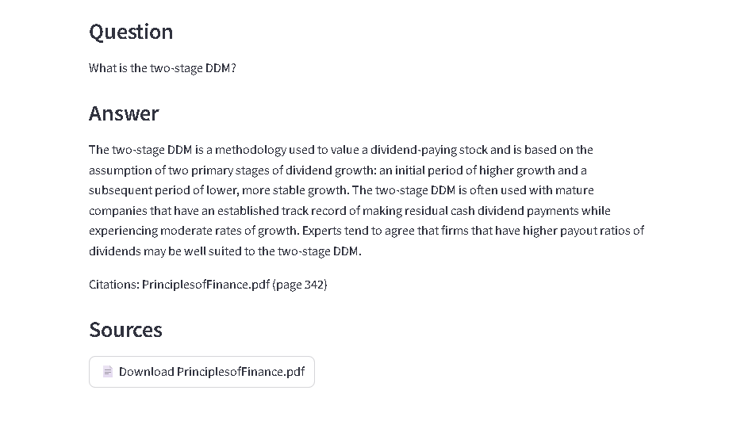

# RAG (Retrieval-Augmented Generation) Project

A document-based question-answering system that retrieves relevant context and generates accurate answers using transformer models.

## Features

- **Vector-based Retrieval**: Uses embeddings to find relevant document chunks
- **Reranking**: Cross-encoder reranking for improved relevance
- **Citation Tracking**: Automatically includes sources for generated answers
- **Memory Context**: Supports conversation history for contextual responses

## Setup

### Installation

1. Clone the repository:

```bash
git clone https://github.com/Redoniii/Finance-chatbot.git
cd Finance-chatbot
```

2. Create a virtual environment:

```bash
python -m venv venv
```

3. Activate the virtual environment:

**Windows:**
```bash
venv\Scripts\activate
```

**Mac/Linux:**
```bash
source venv/bin/activate
```

4. Install dependencies:
```bash
pip install -r requirements.txt
```

## How to Run

**Note:** Place all PDF documents in the `data/` folder before running `ingest.py`.  
If the answer is not present in the documents, the bot will respond:  
"I don't know based on the provided documents."


1. **Ingest documents**:
```bash
python rag/ingest.py
```


2. **Build vector index**:
```bash
python rag/index.py
```

3. **Start the chatbot**:
```bash
streamlit run app.py
```

### Questions to test it
**1:** Explain Finance in 1 sentence.
**2:** What is IMF?
**3:** What is blended Finance?
**4:** Who is Albin Kurti?
**5:** What is the two-stage DDM?
**6:** What is Program trading?
**7:** What is Income Statement?

### Configuration

Edit `generate.py` to adjust:
- `SIMILARITY_THRESHOLD`: Relevance cutoff (default: 0.8)
- `max_length`: Maximum answer length (default: 300)
- `temperature`: Generation randomness (default: 0.7)
- `MODEL_NAME` : I used "declare-lab/flan-alpaca-base" but you can use stronger models from declare-lab like "declare‑lab/flan‑alpaca‑large", declare‑lab/flan‑alpaca‑xl and declare‑lab/flan‑alpaca‑xxl depending on the hardware you got.

## Performance Notes

- For GPU: Change `device=-1` to `device=0` in `generate.py`

## Screenshots









**Note:** You can also find the images in the /images folder

## License

